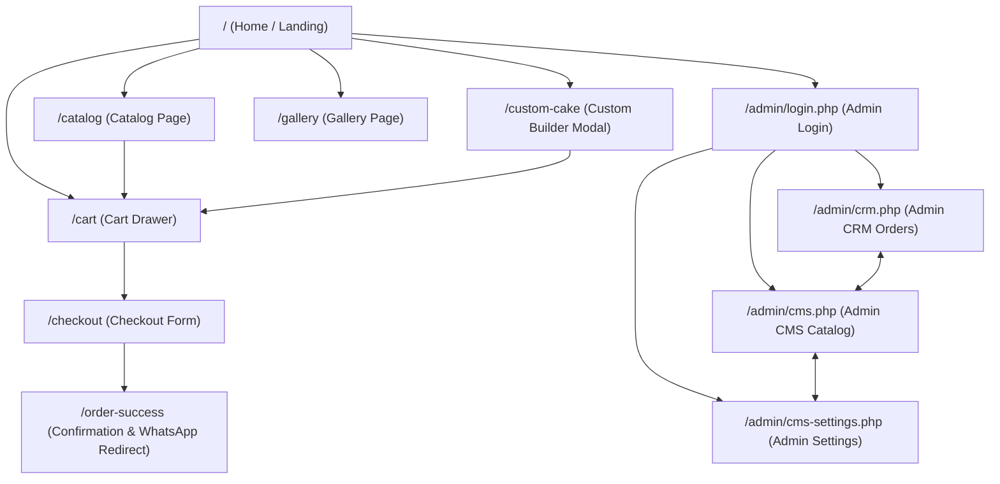

# Application Flow & UX Architecture Document - Version 2

## **App Name**
**Raj Confections** (Kolkata, India)

## **Document Purpose**
This document serves as the complete UX specification and Application Flow blueprint for **Raj Confections Version 2**. It provides an exhaustive, unambiguous blueprint covering all user interfaces, user journeys, navigation trees, button actions, UI states (empty, loading, error, success), admin authentication, and the offline WhatsApp payment workflow.

---

## **1. Design Strategy & Platform Focus**

| Component | Target Platform | Primary Form Factor Focus | Design & Interaction Philosophy |
| :--- | :--- | :--- | :--- |
| **Customer Web App** | Web (React served via PHP) | **Mobile Phones** (Mobile-First) | Touch-first, large tap targets, bottom cart drawer, instant mobile WhatsApp deep-linking, fast image uploads via Cloudflare R2. |
| **Admin Back-Office** | Web (PHP Server-Rendered / Portal) | **Laptops & Desktops** (Wide-Screen) | Data-dense grids, side-by-side order detail drawers, keyboard shortcuts, fast status filters, background WhatsApp notification alerts. |

---

## **2. Complete Screen & Page Architecture**

### **A. Customer-Facing Website (Mobile-First)**

#### **Screen 1: Home / Landing Screen (`/`)**
* **Header / Sticky Navigation:**
  * Brand Logo (*"Raj Confections - Happiness Homemade"*).
  * Kolkata Location Badge (*"Kolkata • Delivery within 10 km"*).
  * Cart Icon with badge count (opens Cart Drawer).
  * Mobile Navigation Menu Trigger (Hamburger icon).
* **Persistent Specialty Banner:**
  * Banner text loaded from CMS: *"100% Eggless | Gluten-Free | Lactose-Free Creams | Pure Homemade Hygiene"*.
* **Hero Section:**
  * High-res banner image of signature Kolkata bakes.
  * Headline: *"Custom & Specialty Cakes in Kolkata"*.
  * Primary CTA: `[ Browse Catalog ]` (scrolls to/navigates to `/catalog`).
  * Secondary CTA: `[ Build Custom Cake ]` (opens Custom Builder).
* **Category Highlight Carousel:** Quick filter pills linking directly to Catalog categories.
* **Why Choose Us Section:** Kolkata heritage, 3-day prior ordering notice, zero preservatives disclaimer.
* **Footer:** Contact numbers (`+91-94774 89551`, `+91-94323 65368`), Kolkata origin info, social links, `[ Admin Portal ]` text link.

---

#### **Screen 2: Catalog Page (`/catalog`)**
* **Category Filter Bar:** Sticky horizontal scrollable tab bar (`All`, `Standard Cakes`, `Specialty & Fruit`, `Winter Specials`, `Chocolates & Small Bakes`).
* **Search & Sort Toolbar:** Text input search filter (*"Search vanilla, black forest..."*) and sort dropdown (*"Price: Low to High"*, *"Popularity"*).
* **Product Grid:** Responsive grid (1 column on mobile, 2 columns on tablet, 3-4 on desktop).
  * **Product Card UI:**
    * Product Image (loaded from Cloudflare R2 CDN).
    * Category Tag & Availability Badge (*In Stock* or *Out of Stock*).
    * Title & Short Description.
    * Price Selector: Radio button toggle for weight/unit (e.g., `1 lb - ₹450` vs `2 lb - ₹800`).
    * CTA Button: `[ Add to Cart ]` (triggers animated feedback and updates cart state).

---

#### **Screen 3: Custom Cake Builder Modal / Page (`/custom-cake`)**
* **Header:** Title *"Design Your Custom Cake"*, Close `[ X ]` button.
* **Form Inputs:**
  1. **Flavor Base Dropdown:** Select from available customized flavor bases (`Chocolate Flavor - ₹500/lb`, `White Forest / Red Velvet - ₹600/lb`, `Custom Request`).
  2. **Estimated Weight Selector:** Pill selector (`1 lb`, `2 lb`, `3 lb+`).
  3. **Reference Image Upload Box (Cloudflare R2):**
     * Drag-and-drop zone or file picker button (`[ Upload Design Photo ]`).
     * Supports JPG, PNG, WEBP (Max 5MB).
     * Shows upload progress bar and thumbnail preview upon upload completion to Cloudflare R2.
     * Remove button `[ Trash Icon ]` to clear image.
  4. **Text Description & Message Box:** Textarea (*"Describe design, colors, wording on cake, dietary constraints..."*).
* **Footer Action Bar:**
  * Calculated Base Price indicator (e.g., `Estimated Base: ₹600`).
  * CTA Button: `[ Add Custom Cake to Cart ]`.

---

#### **Screen 4: Gallery Page (`/gallery`)**
* **Header:** *"Kolkata Customer Showcase & Celebration Moments"*.
* **Masonry / Uniform Grid:** Photos of real cakes delivered in Kolkata.
* **Lightbox Modal:** Tapping an image opens high-resolution image in full screen with caption.

---

#### **Screen 5: Cart Drawer (`/cart`)**
* **Slide-over Drawer (Mobile Bottom / Desktop Right):**
* **Cart Header:** Title *"Your Cake Cart"*, Item count badge, Close `[ X ]` button.
* **Item List:**
  * Item Thumbnail, Title, Selected Weight/Variant, Price.
  * Quantity Counter: `[ - ]` `[ Qty ]` `[ + ]` controls.
  * Custom item notes summary (if custom cake).
  * Delete Item button `[ Trash Icon ]`.
* **Upsell Extras Section:** Horizontal scroll card picker (*"Party Essentials"*):
  * Birthday Candles (`+ ₹30`), Party Poppers (`+ ₹50`), Birthday Knife (`+ ₹20`).
  * One-tap `[ + Add ]` button per extra.
* **Price Breakdown Summary:**
  * Subtotal.
  * Estimated Delivery Charge (calculated at checkout).
  * Total Amount.
* **Cart Footer CTA:** `[ Proceed to Checkout ]` button.

---

#### **Screen 6: Checkout & Location Validation (`/checkout`)**
* **Header:** *"Fulfillment & Checkout"*, Back `[ <- ]` button.
* **Section 1: Fulfillment Type Toggle:**
  * Switch tabs: `[ Home Delivery ]` vs `[ Pickup from Bakery ]`.
* **Section 2: Address & Location Distance Check (If Delivery):**
  * Address Textarea (*"Street, Apartment, Area, Kolkata Pin Code"*).
  * `[ Validate Delivery Location ]` button.
  * *Distance Engine Logic:* Geocodes Kolkata address and runs Haversine formula against bakery coordinates (`22.5726° N, 88.3639° E`).
  * **If <= 10 km:** Displays green success pill *"Eligible for Kolkata Delivery (~X.X km away)"*.
  * **If > 10 km:** Blocks delivery submission and displays red alert message *"Address is outside our 10 km delivery radius (~X.X km away). Please switch to Pickup from Bakery."*
* **Section 3: Fulfillment Date & Time Picker:**
  * Date Picker (Enforces minimum 3-day prior ordering notice as per store policy).
  * Time Slot Dropdown (`10:00 AM - 1:00 PM`, `1:00 PM - 4:00 PM`, `4:00 PM - 7:00 PM`).
* **Section 4: Customization Details:**
  * Text Field: *"Name on Cake"* (e.g., "Happy 25th Rahul").
  * Text Field: *"Special Instructions / Allergy Notes"*.
* **Section 5: Customer Contact Info:**
  * Text Field: *"Full Name"* (Required).
  * Text Field: *"WhatsApp Phone Number"* (Required, 10-digit validation).
* **Section 6: Terms & Order Disclaimers:**
  * Hardcoded notice: *"Orders are manually confirmed via WhatsApp. A 30-40% advance payment via UPI/QR is required to finalize order."*
* **Checkout Footer:**
  * Order Total Display.
  * Primary Action Button: `[ Place Order & Confirm via WhatsApp ]`.

---

#### **Screen 7: Order Confirmation & WhatsApp Redirection Modal (`/order-success`)**
* **Success Banner:** Animated green checkmark, Title *"Order Placed Successfully!"*.
* **Order Reference Box:** Displaying Order ID `#RC-XXXX` and timestamp.
* **Instructional Card:**
  * Headline: *"Contact us to complete payment and track status"*
  * Body Text: *"Your order details have been saved in our system. To finalize your order and receive UPI payment instructions, please connect with us on WhatsApp."*
* **Primary CTA Button:** `[ Chat with Us on WhatsApp ]` (Green WhatsApp icon button, linking to `wa.me/<admin_number>?text=Hi%20Raj%20Confections,%20I%20placed%20Order%20%23RC-XXXX...`).
* **Persistent Warning Callout:** *"Placed an order? Contact us to know more."*

---

### **B. Admin Back-Office Web App (Laptop-First)**

#### **Screen 8: Admin Login Screen (`/admin/login.php`)**
* **Centered Login Card (Desktop):**
  * Brand Logo & Subtitle *"Raj Confections Admin Portal"*.
  * Username Input.
  * Password Input.
  * `[ Login to Admin Panel ]` button.

---

#### **Screen 9: Admin CRM - Order Management (`/admin/crm.php`)**
* **Top Navigation Bar:**
  * Logo, Active Page Tabs (`[ CRM Orders ]`, `[ CMS Catalog ]`, `[ CMS Gallery & Settings ]`), Admin Logout button.
* **Control Toolbar:**
  * Tab Filter: `[ Pending Orders (X) ]` vs `[ All / Completed Orders ]`.
  * Search Bar: Search by Order ID, Customer Name, Phone Number.
  * Date Range Filter Picker.
* **Orders Data Table (Wide-Screen Layout):**
  * Columns: `Order ID`, `Date/Time`, `Customer Name & Phone`, `Fulfillment Type & Date`, `Delivery Address`, `Items Summary`, `Total Amount`, `Status`, `Actions`.
  * **Action Buttons per Row:**
    * `[ View Full Details ]` (opens side-drawer modal).
    * `[ Mark Done ]` (updates status to `completed`, removes from Pending view).
    * `[ WhatsApp Customer ]` (opens `wa.me/<customer_phone>` directly).
* **Order Detail Side-Drawer / Modal:**
  * Complete breakdown of items, custom cake Cloudflare R2 reference photo preview (clickable for full resolution), special instructions, delivery distance, and timestamp.

---

#### **Screen 10: Admin CMS - Catalog Management (`/admin/cms.php`)**
* **Header Bar:** Title *"Catalog Management"*, Button `[ + Add New Product ]`.
* **Category Filter Pills:** Filter view by product category.
* **Product Management Table / Grid:**
  * Image Thumbnail (Cloudflare R2), Title, Category, 1 lb Price, 2 lb Price, Status Badge (*Available* / *Out of Stock*).
  * Actions: `[ Edit ]`, `[ Toggle Availability ]`, `[ Delete ]`.
* **Add / Edit Product Modal:**
  * Product Name, Description, Category Dropdown.
  * Price (1 lb) & Price (2 lb) numeric inputs.
  * Product Image Upload field (uploads directly to Cloudflare R2 bucket via `POST /api/upload.php`).
  * Availability Switch (`Active` / `Inactive`).
  * Save Button: `[ Save Product ]`.

---

#### **Screen 11: Admin CMS - Gallery & Settings (`/admin/cms-settings.php`)**
* **Tab 1: Gallery Manager:**
  * Upload showcase images to Cloudflare R2, edit title captions, delete images.
* **Tab 2: Site Settings & Banner Control:**
  * Announcement Banner Text input (*"100% Eggless..."*).
  * Kolkata Origin Lat/Lng inputs (default `22.5726`, `88.3639`).
  * Maximum Delivery Radius input (default `10` km).
  * Admin WhatsApp Receiver Phone Number input.
  * Save Settings button `[ Save All Settings ]`.

---

## **3. User Journeys**

```
+-----------------------------------------------------------------------------------+
|                        JOURNEY A: STANDARD CAKE ORDERING                          |
+-----------------------------------------------------------------------------------+
  Guest User opens Landing Page (Mobile)
   │
   ▼
  Navigates to /catalog ──► Selects "Black Forest Cake (2 lb)" ──► Clicks [ Add to Cart ]
   │
   ▼
  Cart Drawer slides open ──► Adds "Birthday Candles" extra ──► Clicks [ Proceed to Checkout ]
   │
   ▼
  On Checkout (/checkout):
   ├── Selects [ Home Delivery ]
   ├── Enters Kolkata Address ──► Clicks [ Validate ] ──► System validates <= 10 km (Green)
   ├── Selects Date (3 days out) & Time slot
   └── Fills Name ("Rahul") & WhatsApp Phone Number
   │
   ▼
  Clicks [ Place Order & Confirm via WhatsApp ]
   │
   ▼
  1. API POST /api/orders.php ──► Saves order #RC-1042 to MySQL
  2. Server ──► Dispatches automated WhatsApp notification to Admin
  3. Client redirect ──► Screen 7 (Confirmation Screen)
   │
   ▼
  User clicks [ Chat with Us on WhatsApp ] ──► Opens WhatsApp app with pre-filled message
```

```
+-----------------------------------------------------------------------------------+
|                  JOURNEY B: CUSTOM CAKE REQUEST WITH R2 UPLOAD                    |
+-----------------------------------------------------------------------------------+
  Guest User clicks [ Build Custom Cake ] on Header / Hero
   │
   ▼
  Custom Cake Modal (/custom-cake) opens
   ├── Selects Flavor Base ("Red Velvet - ₹600/lb")
   ├── Selects Weight ("2 lb")
   ├── Uploads reference design photo ──► File uploaded to Cloudflare R2 bucket
   └── Types description ("Eggless, red velvet with heart shape fondant icing")
   │
   ▼
  Clicks [ Add Custom Cake to Cart ] ──► Added to Cart Drawer with R2 Image URL reference
   │
   ▼
  Proceeds through Checkout ──► Submits Order ──► Redirects to WhatsApp
```

```
+-----------------------------------------------------------------------------------+
|                  JOURNEY C: ADMIN CRM ORDER FULFILLMENT                           |
+-----------------------------------------------------------------------------------+
  Admin receives automated WhatsApp alert on phone: "New Order #RC-1042 received!"
   │
   ▼
  Admin opens /admin/login.php on Laptop ──► Logs in
   │
   ▼
  Redirected to /admin/crm.php (Pending Orders Tab)
   │
   ▼
  Locates Order #RC-1042 ──► Clicks [ View Details ] to inspect custom R2 image & address
   │
   ▼
  Clicks [ WhatsApp Customer ] ──► Opens WhatsApp Web chat to send UPI QR code payment link
   │
   ▼
  Customer pays advance on WhatsApp ──► Admin bakes cake & delivers
   │
   ▼
  Admin returns to CRM ──► Clicks [ Mark Done ] ──► Order status set to 'completed' & hidden
```

---

## **4. Detailed Navigation Flow & Route Map**



---

## **5. Button-by-Button Action Dictionary**

| Button / UI Control | Screen | ID / Selector | Triggered Event / Action | Target Endpoint / State Change |
| :--- | :--- | :--- | :--- | :--- |
| `[ Browse Catalog ]` | Screen 1 | `#btn-hero-catalog` | Navigates to catalog view | Route: `/catalog` |
| `[ Build Custom Cake ]` | Screen 1, Header | `#btn-custom-cake` | Opens Custom Cake modal | State: `isCustomModalOpen = true` |
| `[ Add to Cart ]` | Screen 2 | `#btn-add-cart-{id}` | Adds product variant to cart array | State: `cart.push(item)` |
| `[ Upload Design Photo ]` | Screen 3 | `#file-r2-upload` | Trigger file input & upload to R2 | API: `POST /api/upload.php` |
| `[ Add Custom Cake to Cart ]` | Screen 3 | `#btn-add-custom-cart` | Compiles custom specs into cart item | State: `cart.push(customItem)` |
| `[ Qty + / - ]` | Screen 5 | `.btn-cart-qty` | Increments/decrements quantity | State: `updateCartQty(id, delta)` |
| `[ Add Upsell Extra ]` | Screen 5 | `.btn-add-upsell` | Adds candle/popper extra item to cart | State: `cart.push(extraItem)` |
| `[ Proceed to Checkout ]` | Screen 5 | `#btn-cart-checkout` | Opens checkout page | Route: `/checkout` |
| `[ Validate Delivery Location ]` | Screen 6 | `#btn-validate-distance` | Geocodes address & runs Haversine formula | Client Haversine script |
| `[ Place Order & Confirm via WhatsApp ]` | Screen 6 | `#btn-place-order` | Submits form & persists order in DB | API: `POST /api/orders.php` |
| `[ Chat with Us on WhatsApp ]` | Screen 7 | `#btn-whatsapp-redirect` | Opens native WhatsApp app with pre-filled message | Deep link: `wa.me/<admin_phone>?text=...` |
| `[ Login to Admin Panel ]` | Screen 8 | `#btn-admin-login` | Authenticates credentials & sets session | API: `POST /api/admin/login.php` |
| `[ Mark Done ]` | Screen 9 | `.btn-crm-mark-done` | Updates order status to `completed` | API: `PUT /api/orders.php?id={id}` |
| `[ WhatsApp Customer ]` | Screen 9 | `.btn-crm-whatsapp` | Opens WhatsApp Web chat with customer | Link: `wa.me/<customer_phone>` |
| `[ Save Product ]` | Screen 10 | `#btn-cms-save-product` | Saves product details & Cloudflare R2 image URL | API: `POST /api/products.php` |

---

## **6. UI States Dictionary**

### **A. Empty States**
* **Cart Drawer Empty:** Displays empty cart graphic, text *"Your cake cart is empty! Add delicious bakes from our catalog."*, and a CTA button `[ Explore Catalog ]`.
* **Catalog Search / Filter No Results:** Displays text *"No cakes found matching your search. Try adjusting filters!"* with a `[ Reset Filters ]` button.
* **Admin CRM Pending Orders Empty:** Displays green badge *"All caught up! No pending orders at the moment."* with a button `[ View All Past Orders ]`.
* **Admin CMS Catalog Empty:** Displays table placeholder *"No products found in this category. Click 'Add Product' to get started."*.

---

### **B. Loading & Skeleton States**
* **Catalog Initial Fetch:** Displays shimmer animated card skeletons while fetching `GET /api/products.php`.
* **Cloudflare R2 Image Uploading:** Displays an inline progress bar `[ Uploading image... XX% ]` with disabled submit button.
* **Order Submission Loading:** Button state changes to `[ Submitting Order... Spinner ]` and prevents double-clicking.
* **Admin CRM Table Refresh:** Displays translucent overlay with central spinner during search/filter refetching.

---

### **C. Error States & Validation Messages**

| Error Scenario | Location | UI Behavior & Error Message | Recovery Action |
| :--- | :--- | :--- | :--- |
| **Delivery Radius Exceeded (> 10 km)** | Checkout (Screen 6) | Red alert callout: *"Address is outside our 10 km Kolkata delivery radius (~14.2 km). Please select 'Pickup from Bakery'."* | Blocks form submission; forces toggle to Pickup. |
| **Fulfillment Date < 3 Days** | Checkout (Screen 6) | Inline field error: *"Orders require at least 3 days prior notice for fresh preparation."* | Disables invalid dates on calendar picker. |
| **Invalid Phone Number** | Checkout (Screen 6) | Inline error text: *"Please enter a valid 10-digit WhatsApp phone number."* | User corrects phone number input. |
| **Cloudflare R2 Upload Failed** | Custom Builder (Screen 3) | Toast message: *"Failed to upload image to Cloudflare R2 storage. Please check file size (<5MB) and try again."* | Retries upload button. |
| **Admin Login Invalid Credentials** | Admin Login (Screen 8) | Alert box: *"Invalid username or password. Please check your credentials."* | Re-enter credentials. |
| **API Network Failure** | Global / Checkout | Modal alert: *"Network connection error. Your order was not saved. Please check your connection and retry."* | Provides `[ Retry Order Submission ]` button. |

---

### **D. Success States**
* **Item Added to Cart:** Bottom toast notification: *"Added [Cake Name] to cart!"* with quick `[ View Cart ]` button.
* **Cloudflare R2 Image Upload Complete:** Shows green check icon badge *"Image uploaded successfully"* with a thumbnail preview.
* **Order Submitted Successfully:** Smooth transition to Screen 7 (Order Confirmation screen) with confetti micro-animation and visible `#RC-XXXX` order code.
* **CRM Order Marked Done:** Banner notification in Admin CRM: *"Order #RC-1042 marked as Completed."*

---

## **7. Login & Authentication Flow (Admin Only)**

```
                      +-----------------------------+
                      |  POST /api/admin/login.php  |
                      +--------------+--------------+
                                     |
                         +-----------┴-----------+
                         | Valid Credentials?    |
                         +-----+-----------+-----+
                            YES|           |NO
                               |           |
                               ▼           ▼
             +--------------------+     +--------------------------------+
             | Set HTTP-Only      |     | Return 401 Unauthorized        |
             | Session Cookie     |     | Show error on Screen 8         |
             +---------+----------+     +--------------------------------+
                       |
                       ▼
             +--------------------+
             | Redirect to        |
             | /admin/crm.php     |
             +--------------------+
```

* **Session Persistence:** HTTP-Only, Secure PHP Session cookie (`PHPSESSID`).
* **Route Protection:** PHP backend inspects session on all `/admin/*.php` pages and API routes; unauthorized requests redirect to `/admin/login.php`.
* **Logout Action:** Clicking `[ Logout ]` destroys session cookie and redirects to login page.

---

## **8. Payment & Order Fulfillment Workflow**

```
+-----------------------------------------------------------------------------------+
|                     OFFLINE WHATSAPP PAYMENT WORKFLOW                             |
+-----------------------------------------------------------------------------------+
 1. CUSTOMER PLACES ORDER ON WEBSITE
    - Order saved to MySQL DB with status = 'pending'.
    - Customer shown Screen 7 with Order ID #RC-1042.

 2. REDIRECT TO WHATSAPP
    - Customer clicks [ Chat with Us on WhatsApp ].
    - Native WhatsApp app opens with pre-filled message:
      "Hi Raj Confections, I placed Order #RC-1042 on your website for 2 lb Red Velvet Cake. Please confirm payment details."

 3. ADMIN REVIEW & ADVANCE PAYMENT INSTRUCTION
    - Admin receives notification on Admin WhatsApp and checks Admin CRM on laptop.
    - Admin replies on WhatsApp sharing the bakery's UPI QR Code / PhonePe / GPay number.
    - Message explicitly requests 30-40% advance payment as per store policy.

 4. ADVANCE PAYMENT RECEIVED & BAKING INITIATED
    - Customer sends UPI payment screenshot on WhatsApp.
    - Admin confirms order verbally on WhatsApp and schedules baking for requested delivery date.

 5. DELIVER / PICKUP & ORDER COMPLETION
    - Cake is prepared and handed over to customer (pickup or 10km Kolkata delivery).
    - Customer pays remaining balance via UPI/Cash.
    - Admin opens Admin CRM (/admin/crm.php) on laptop and clicks [ Mark Done ].
    - Order status updated to 'completed' in DB and cleared from pending list view.
```
